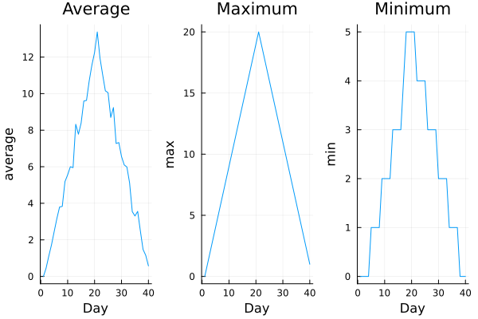

::::::::::::::::::::::::::::::::::::::: objectives

- Explain what a `for` loop does.
- Correctly write `for` loops to repeat simple calculations.
- Explain what a `while` loop does.
- Trace changes to a loop variable as the loop runs.
- Trace changes to other variables as they are updated by a `for` loop.

::::::::::::::::::::::::::::::::::::::::::::::::::

:::::::::::::::::::::::::::::::::::::::: questions

- How can I do the same operations on many different values?

::::::::::::::::::::::::::::::::::::::::::::::::::

In the episode *"Visualizing Tabular Data"*, we wrote Julia code that plots values of interest from our first inflammation dataset (`inflammation-01.csv`), which revealed some suspicious features in it.

{alt="Line graphs showing average, maximum and minimum inflammation across all patients over a 40-day period."}

We now have a dozen datasets, and potentially more on the way if Dr. Maverick keeps up their surprisingly fast clinical trial rate. 
We would like to create plots for all of our datasets without having to copy-paste code for each file.

To do that, we need to teach the computer how to repeat actions automatically —
this is where *loops* come in.


An example of a task that can be solved with a loop is accessing the numbers stored in a vector.
We could do this by printing each number on its own.


```julia
odds = [1, 3, 5, 7]
```

In Julia, an array (1D arrays are called vectors, 2D arrays are called matrices) is an ordered collection of elements, and each element has a unique number associated with it — its **index**.

For example, the first number in `odds` is accessed via `odds[1]`.
One way to print each number is to write four separate `println` statements:

```julia
println(odds[1])
println(odds[2])
println(odds[3])
println(odds[4])
```

```output
1
3
5
7
```

However, this approach has three major drawbacks:

1. **Not scalable** – if the array has hundreds of elements, writing one line per element is unmanageable.
2. **Difficult to maintain** – if we want to decorate each element an asterisk or any other character, we’d have to change every line.
3. **Fragile** – if the array is longer or shorter than expected, we either miss elements or get an error.

Example with a shorter array:

```julia
odds = [1, 3, 5]
println(odds[1])
println(odds[2])
println(odds[3])
println(odds[4])
```

```output
1
3
5
```

```error
ERROR: BoundsError: attempt to access 3-element Vector{Int64} at index [4]
```

Here’s a better approach: a [for loop](../learners/reference.md#for-loop)

```julia
odds = [1, 3, 5, 7]

for num in odds
    println(num)
end
```

```output
1
3
5
7
```

This is shorter — definitely shorter than writing a `println` for every number in a long list — and more robust as well:

```julia
odds = [1, 3, 5, 7, 9, 11]

for num in odds
    println(num)
end
```

```output
1
3
5
7
9
11
```
In a `for` loop, the loop variable (like num in the example) is just a name we give to each element of the collection as we go through it.

- `num` is the loop variable.

- During the first iteration, num = 1; during the second, num = 3; and during the third, num = 5, etc.

- You can choose any valid variable name instead of num

In Julia, the general form of a `for` loop is:

```julia
for variable in collection
    # do things using variable, such as println
end
```

Here’s another loop that repeatedly updates a variable:

```julia
count = 0
people = ["Curie", "Darwin", "Turing"]

for person in people
    count += 1
end

println("There are ", count, " names in the vector.")
```

```output
There are 3 names in the vector.
```

It’s worth tracing the execution of this little program step by step.
Since there are three names in `people`,
the statement inside the loop will be executed three times.

- First iteration: `count` is 0 (set on line 1) and `person` is `"Curie"`.
  `count = count + 1` updates `count` to `1`.

- Second iteration: `person` is `"Darwin"` and `count` is `1`, so `count` becomes `2`.

- Third iteration: `person` is `"Turing"` and `count` becomes `3`.

Since there are no more elements in `people`, the loop finishes.
Finally, the `println` statement shows the result.


Note that in Julia, the loop variable does not overwrite a variable with the same name outside the loop.
The loop variable is local to the loop, so it only exists inside the loop body.

For example:

```julia
person = "Rosalind"

for person in ["Curie", "Darwin", "Turing"]
    println(person)
end

println("after the loop, name is ", person)
```

```output
Curie
Darwin
Turing
after the loop, name is Rosalind
```

Note also that finding the length of an object is such a common operation
that Julia has a built-in function for it called `length`:

```julia
println(length([0, 1, 2, 3]))
```

```output
4
```

`length` is much faster than any function we could write ourselves,
and much easier to read than writing a loop to count elements.
It also works on many different kinds of collections in Julia,
so we should always use it when we can.

## While Loops

Sometimes, we want to repeat an action until a certain condition is met, rather than looping over a collection.
For this, Julia provides a "while loop".

The general form is:

```julia
while condition
    # do something
end
```

Example:

```julia
count = 0

while count < 5
    println("count is ", count)
    count += 1
end
```

```output
count is 0
count is 1
count is 2
count is 3
count is 4
```

The loop checks the condition `count < 5` before each iteration.
As long as the condition is `true`, the loop body runs.
Once `count` reaches `5`, the condition is `false` and the loop stops.

ou can use while loops when the number of iterations is not known in advance.
But be careful!: if the condition never becomes false, the loop will run forever (an infinite loop).

!!!WARNING!!!
Example of a potential infinite loop:

```julia
x = 0
while x < 3
    println(x)
end
```

This will print `0` endlessly because `x` never changes.


::::::::::::::::::::::::::::::::::::::: challenge

## Understanding the loops

Given the following loop:

```julia
word = "oxygen"
for letter in word
    println(letter)
end
```

How many times is the body of the loop executed?

1. 1 times
2. Throws an error
3. 0 times
4. 6 times

---

::::::::::::::::::::::: solution

## Solution

The body of the loop is executed 6 times, once for each character in `"oxygen"`.

:::::::::::::::::::::::::

::::::::::::::::::::::::::::::::::::::::::::::::::

::::::::::::::::::::::::::::::::::::::: challenge

## Computing Powers With Loops

Exponentiation is built into Julia:

```julia
println(5 ^ 3)
```

```output
125
```

Write a loop that calculates the same result as `5 ^ 3` using
multiplication (and without exponentiation).


::::::::::::::::::::::: solution

## Solution

```julia
result = 1
for i in 1:3
    result = result * 5
end
println(result)
```

```output
125
```
:::::::::::::::::::::::::

::::::::::::::::::::::::::::::::::::::::::::::::::

::::::::::::::::::::::::::::::::::::::: challenge

## Summing a vector

Write a loop that calculates the sum of elements in a vector
by adding each element and printing the final value,
so `[124, 402, 36]` prints `562`.


::::::::::::::::::::::: solution

## Solution

```julia
numbers = [124, 402, 36] 
result = 0
for num in numbers
    result = result + num
end
println(result)
```

```output
562
```

:::::::::::::::::::::::::

::::::::::::::::::::::::::::::::::::::::::::::::::

::::::::::::::::::::::::::::::::::::::: challenge

## Analyzing Multiple Patients' Data

In this exercise, we'll use loops to analyze patient data from our clinical trial.

Assume we have loaded the inflammation data as before:

```julia
using CSV, Statistics

data = Matrix(CSV.read("inflammation-01.csv", header = false))
```

This gives us a 60×40 matrix where each row represents a patient and each column represents a day.

### Part 1: Patient Statistics

Write a loop that calculates and prints the average inflammation for each patient (each row):

Expected output format:
```
Patient 1 average: 5.45
Patient 2 average: 5.425
...
```

::::::::::::::: solution

## Solution

```julia
for i in 1:size(data, 1)
    patient_avg = mean(data[i, :])
    println("Patient ", i, " average: ", patient_avg)
end
```

:::::::::::::::::::::::::

### Part 2: Day-by-Day Analysis

Write a loop that finds the maximum inflammation value for each day (each column) and prints it:

Expected output format:
```
Day 1 max: 8
Day 2 max: 11
...
```

::::::::::::::: solution

## Solution

```julia
for j in 1:size(data, 2)
    day_max = maximum(data[:, j])
    println("Day ", j, " max: ", day_max)
end
```

:::::::::::::::::::::::::

### Part 3: Finding High-Inflammation Days

A day is considered "high-inflammation" if the average inflammation for that day is above 8.0.

Write a loop that:
1. Calculates the average inflammation for each day
2. Counts how many days have average inflammation above 8.0
3. Prints the count and the list of those days

::::::::::::::: solution

## Solution

```julia
high_inflammation_days = 0
high_days_list = []

for j in 1:size(data, 2)
    day_avg = mean(data[:, j])
    if day_avg > 8.0
        high_inflammation_days += 1
        push!(high_days_list, j)
    end
end

println("Number of high-inflammation days: ", high_inflammation_days)
println("High-inflammation days: ", high_days_list)
```

:::::::::::::::::::::::::

### Part 4: Patient Trajectory Analysis

For each patient, calculate:
- The inflammation on day 1
- The inflammation on the last day (day 40)
- Whether their inflammation increased, decreased, or stayed about the same

A patient's condition is considered:
- **Improved** if the last day's value is at least 3 less than day 1
- **Worsened** if the last day's value is at least 3 more than day 1
- **Stable** otherwise

Write a loop that prints this analysis for each patient:

Expected output format:
```
Patient 1: Improved (day 1: 0, day 40: 0)
Patient 2: Stable (day 1: 0, day 40: 9)
...
```

::::::::::::::: solution

## Solution

```julia
for i in 1:size(data, 1)
    day1 = data[i, 1]
    day40 = data[i, end]
    change = day40 - day1
    
    if change <= -3
        status = "Improved"
    elseif change >= 3
        status = "Worsened"
    else
        status = "Stable"
    end
    
    println("Patient ", i, ": ", status, " (day 1: ", day1, ", day 40: ", day40, ")")
end
```

:::::::::::::::::::::::::

### Part 5: While Loop Challenge

Write a `while` loop that finds the first day where the average inflammation across all patients exceeds 7.0:

::::::::::::::: solution

## Solution

```julia
day = 1
found = false

while day <= size(data, 2) && !found
    day_avg = mean(data[:, day])
    if day_avg > 7.0
        found = true
    else
        day += 1
    end
end

if found
    println("First day with average inflammation > 7.0: Day ", day, " (average: ", mean(data[:, day]), ")")
else
    println("No day found with average inflammation > 7.0")
end
```

:::::::::::::::::::::::::

::::::::::::::::::::::::::::::::::::::::::::::::::

:::::::::::::::::::::::::::::::::::::::: keypoints

- Use `for variable` to process the elements of a collection (like a vector) one at a time.
- The body of a `for` loop must be placed inside `for ... end`.
- The body of a `while` loop must be placed inside `while ... end`.
- Use `length(thing)` to determine the length of a collection (vector, array, string, etc.).
::::::::::::::::::::::::::::::::::::::::::::::::::